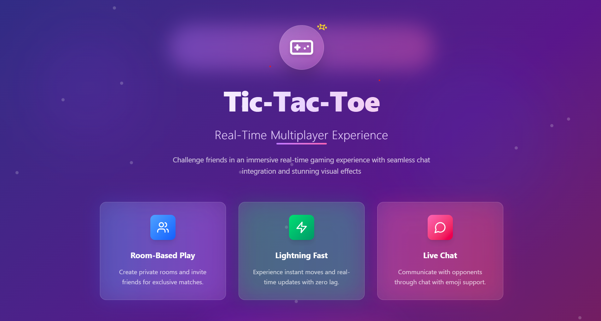
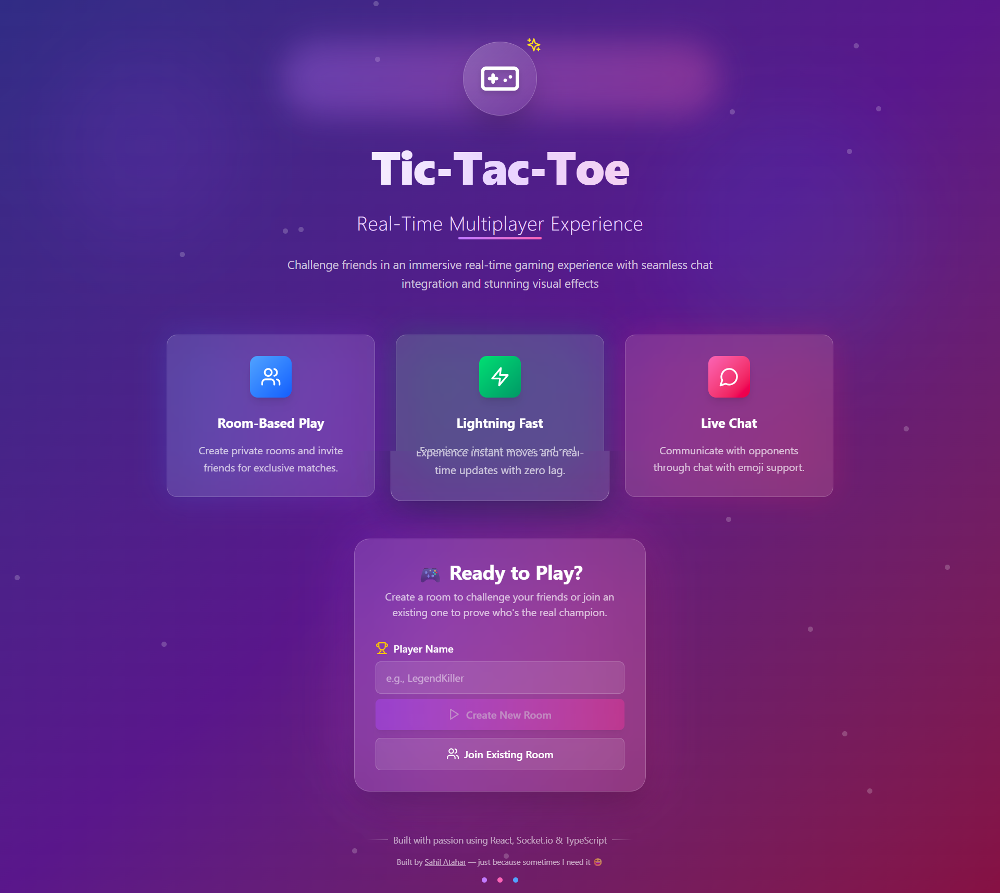
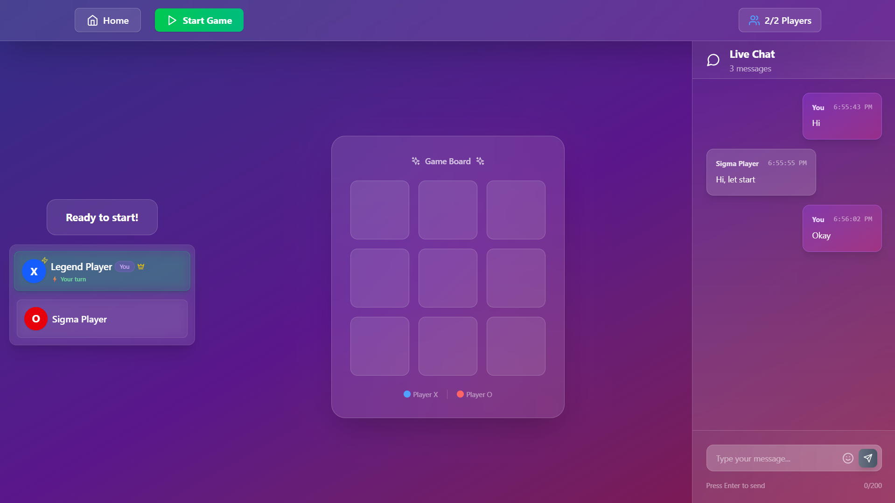
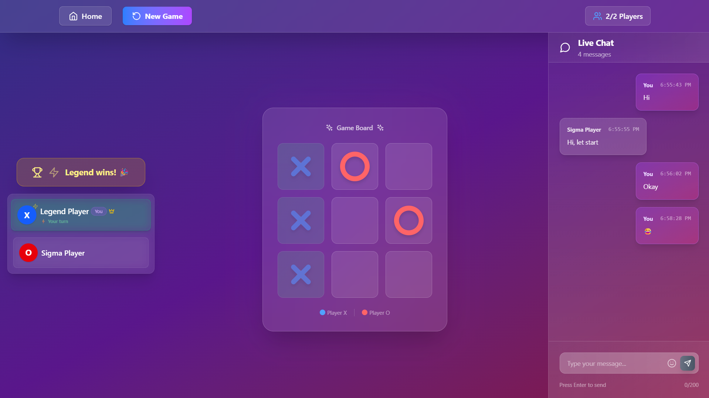

<<<<<<< HEAD
<!-- Preview Banner -->
<p align="center">
  
</p>

<h1 align="center">🎮 Realtime Tic Tac Toe</h1>
<p align="center">No login required • Open Source • React, TypeScript, Express, Socket.io, Tailwind CSS</p>

---

A fast-paced, real-time multiplayer Tic Tac Toe game. No login or signup — enter your name and start playing instantly with friends. Built using modern web technologies with a clean UI and responsive design.
Perfect for learning how to implement WebSockets and real-time communication in web apps.


## ✨ Features

- ⚡ Realtime multiplayer using **Socket.io**.
- 🧩 Simple room creation and joining system.
- 💬 In-game **chat** support.
- 🧑‍🎨 Support player nickname customization.
- 😄 Include emoji reactions during gameplay.
- 🎨 Beautiful UI with **Tailwind CSS**.
- 🧠 Built with **React**, **TypeScript**, **Node.js**, and **Express**.
- 🔒 No authentication or login required.
- 📱 Responsive design for desktop and mobile.
- 🌐 Open-source and self-hostable.

## 🚀 Live Preview

Experience the game instantly without any signup or installation:

🎮 **Play the game live →** [https://tictactoe.aashish.dev/](https://tictactoe.aashish.dev/)

## 🖼️ Screenshots
<p align="center">
  
  <br />
  <em>Lobby - Create or Join Room</em>
</p>
<p align="center">
  
  <br />
  <em>Room - After Joining a Room</em>
</p>
<p align="center">
  
  <br />
  <em>Game Board - Real-time Match + Chat</em>
</p>

## 💻 Tech Stack


## ⚙️ Installation

1. **Fork this repository:** Click the Fork button located in the top-right corner of this page.
2. **Clone the repository:**
   ```bash
   git clone https://github.com/<your-username>/RealTime-Tic-Tac-Toe.git
   ```
3. **Create .env file (Optional):**
   Inside the root directories create `.env` and set:
   ```bash
   VITE_APPLICATION_URL=http://localhost:3000
   PORT=3000
   ```

4. **Install dependencies:**
   ```bash
   npm install
   ```
5. **Run the project:**
   ```bash
   npm run dev
   ```
6. **Access the application:**
   ```bash
   http://localhost:5173/
   ```

## 🔮 Future Enhancements

- 🏠 Add game rooms to allow multiple rounds in one session.
- 👀 Enable spectators to watch live games.
- 🔗 Generate shareable links to invite friends directly.
- 📱 Make the game installable as a Progressive Web App (PWA).
- 🤖 Add a smart AI opponent for single-player mode.

## 🌟 Support Us

If you find this helpful or valuable, please consider 🌟 starring the repository. It helps us gain visibility and encourages further development.

## 🧾 License

This project is licensed under the [MIT License](LICENSE).

## ✍️ About Developer

<table>
  <tbody>
    <tr>
      <td align="center" valign="top">
        
        <br />
        <b>Ashish</b>
      </td>
    </tr>
    <tr>
        <td align="center">
            <a href="https://github.com/AshishRangdal">
            
            </a>
            <br/>
            <a href="https://linkedin.com/in/AshishRangdal">
            
            </a>
        </td>
    </tr>
  </tbody>
</table>
=======
# real-time-tic-tac-toe
real-time-tic-tac-toe
>>>>>>> bc7af25724c5ec3914d68dc04266159fe4e2570d
